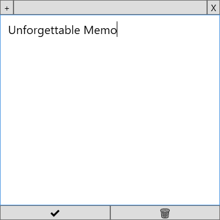

# UnforgettableMemo

A memo APP that shows memos based on memory decay theory. 

## Features

- The memo saves when the text is changed.
- The window pops up when there is a memo somewhat forgotten.
- The window could not be deactivated but could be covered by other windows if every memo has not been forgotten.
- When the review button (✔️) is clicked, the memory status updates.

## Install Desktop Client

1. Download the executable from the release page
1. Schedule a startup for the executable

## Memory Decay Theory

The logic is based on the forgetting curve, mainly from this website <https://supermemo.guru/wiki/Forgetting_curve>.

## Recommended Usage

- Recite vocabularies

## Memo Persistence

Logic goes [here](src/UnforgettableMemo.Shared/Data).

For fast development, the memos are currently stored as JSON.

## TODO

- [ ] Sync on cloud
